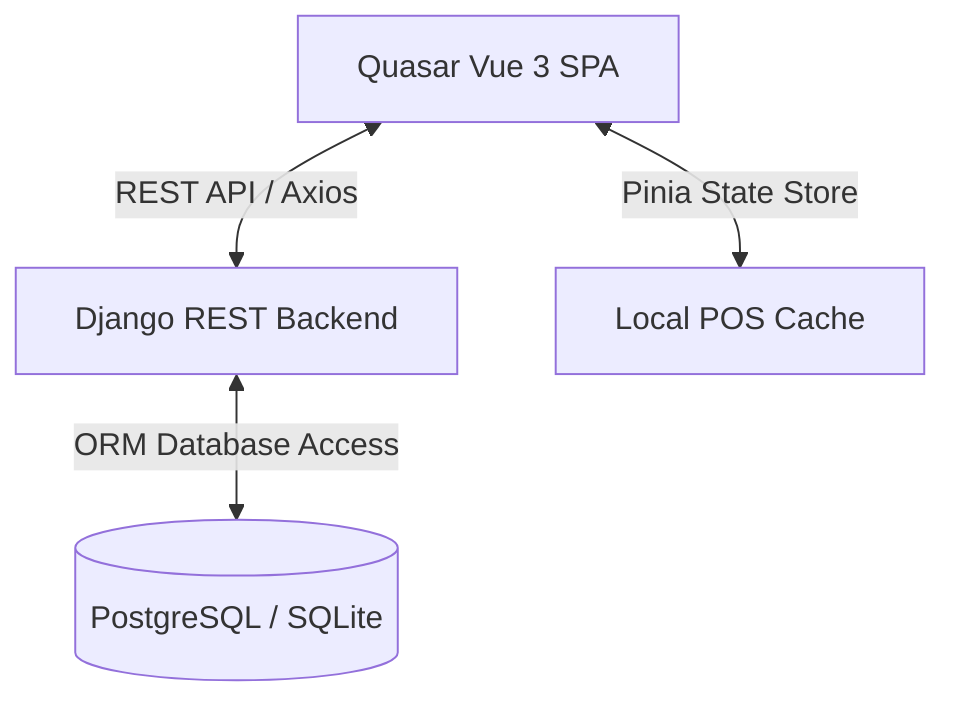

# Nichole Agrivet - POS & Inventory Management System 🌾📦

[](https://vuejs.org)
[](https://quasar.dev)
[](https://djangoproject.com)
[](https://www.django-rest-framework.org/)
[](https://vitejs.dev/)

> **A comprehensive Point-of-Sale (POS) and intelligent inventory management platform built specifically for agricultural supply businesses.**

---

## 🌟 Key Features

1. **Dual Unit Tracking (Bulk & Retail)**:
   - Tracks inventory in both wholesale (e.g. sacks, boxes) and retail units (e.g. kilos, packs).
   - Automatic unit conversion and stock level warnings.

2. **Fast POS Checkout**:
   - Streamlined cashier interface designed for high-volume daily transactions.
   - Real-time total calculation, discount application, and receipt generation.

3. **Customer Credit (Utang) Ledger**:
   - Built-in credit tracking for regular agricultural buyers and farmers.
   - Log outstanding balances, track payment histories, and enforce credit limits.

4. **Profit & Sales Analytics**:
   - Automated cost vs. revenue tracking per transaction.
   - Monthly revenue reports, product demand trends, and profit margin breakdowns.

---

## 🛠️ Architecture Overview



---

## 📁 Repository Structure

```
Agrivet-Inventory-System/
├── backend/                  # Django REST Framework Backend
│   ├── core/                 # Settings, URLs, WSGI
│   ├── inventory/            # Product, Stock & Category models
│   ├── sales/                # Transactions, POS & Credit ledger models
│   └── manage.py
├── frontend/                 # Vue 3 + Quasar SPA (Vite)
│   ├── src/
│   │   ├── components/       # Reusable POS & Inventory UI Components
│   │   ├── pages/            # Dashboard, POS, Inventory, Reports & Ledger Views
│   │   ├── router/           # Navigation Routes & Guards
│   │   └── stores/           # Pinia State Management
│   ├── vite.config.js
│   └── package.json
└── README.md
```

---

## 🚀 Local Setup & Development

### 1. Backend (Django REST API)

```bash
cd backend

# Create & activate virtual environment
python -m venv .venv
# On Windows:
.venv\Scripts\activate
# On Linux/macOS:
source .venv/bin/activate

# Install dependencies & run migrations
pip install -r requirements.txt
python manage.py migrate

# Start backend dev server
python manage.py runserver
```
The REST API will run at `http://127.0.0.1:8000/api/`

---

### 2. Frontend (Vue 3 + Quasar)

```bash
cd frontend

# Install Node dependencies
npm install

# Start Vite dev server
npm run dev

# Build production bundle
npm run build
```
The Web App will run at `http://localhost:9000/`

---

## 🌐 Deployment Configuration

### 1. Backend (Render / Railway)
- **Root Directory**: `backend`
- **Build Command**: `pip install -r requirements.txt && python manage.py migrate`
- **Start Command**: `gunicorn core.wsgi:application`

### 2. Frontend (Vercel)
- **Root Directory**: `frontend`
- **Build Command**: `npm run build`
- **Output Directory**: `dist/spa`
- **Environment Variable**: `VITE_API_URL` = `https://<your-backend-domain>/api/`

---

## 📄 License

Distributed under the MIT License. See `LICENSE` for details.
